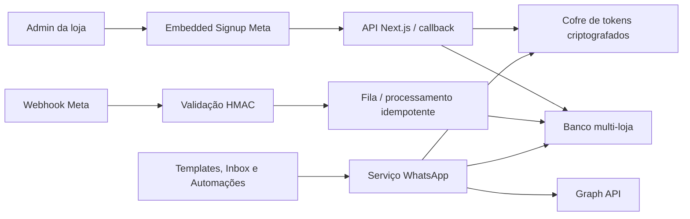

# Integração WhatsApp Cloud API — arquitetura e implantação

## Objetivo

Conectar cada loja da UP Zero ao WhatsApp Cloud API por Embedded Signup, mantendo números, templates, conversas, envios e automações isolados por loja.

Este desenho foi comparado com:

- `itsvitinhoin/up-dash-b2b`: implementação já aprovada pela Meta e usada como referência funcional principal.
- `fbsamples/business-messaging-sample-tech-provider-app`: sample oficial usado para validar o ciclo de Embedded Signup, registro de número, webhooks e envio de templates.

## O que já existe no Admin

- Tela de Conexões com Embedded Signup.
- Captura independente do `code` de autenticação e do evento `WA_EMBEDDED_SIGNUP`.
- Estrutura de números, templates, inbox, campanhas e automações.
- Criação de templates com placeholders numéricos sequenciais (`{{1}}`, `{{2}}`, ...).
- Seleção do payload correspondente a cada placeholder.
- Configuração de telefone de fallback na conexão.
- Webhook GET para validação do callback.
- Webhook POST com verificação HMAC `x-hub-signature-256`.
- Graph API configurável, com `v24.0` como versão padrão.

## Diferenças encontradas

### Implementação aprovada (`up-dash-b2b`)

A implementação aprovada persiste os dados por cliente em PostgreSQL. A integração guarda, por loja, o token retornado pelo Embedded Signup, WABA, Business ID, números, número padrão, templates e conversas. O webhook valida a assinatura antes de processar o corpo bruto.

### Sample oficial da Meta

O sample oficial confirma o fluxo recomendado:

1. carregar o Facebook SDK;
2. abrir `FB.login` com o Configuration ID;
3. receber o `code` de autenticação;
4. receber separadamente o evento `WA_EMBEDDED_SIGNUP`;
5. trocar o `code` no servidor;
6. persistir o token no servidor, associado ao cliente autenticado;
7. registrar o telefone quando necessário;
8. inscrever a WABA no webhook;
9. sincronizar ativos e iniciar mensageria.

### Situação anterior deste Admin

O módulo usava `FACEBOOK_SYSTEM_USER_TOKEN` global em todas as lojas e salvava estado em arquivo local. Esse modelo serve para protótipo local, mas não pode ser a fonte de verdade em produção porque:

- mistura credenciais entre lojas;
- o filesystem da Vercel é temporário;
- uma nova instância pode não enxergar o mesmo estado;
- o token retornado pelo Embedded Signup não era persistido;
- não havia garantia de idempotência para eventos do webhook.

## Arquitetura definitiva



O frontend nunca recebe App Secret, token de acesso persistido ou chave de criptografia.

## Modelo de dados mínimo

Todas as tabelas precisam conter `store_id` (ou o identificador de tenant equivalente).

### `whatsapp_integrations`

- `id`
- `store_id`
- `meta_business_id`
- `waba_id`
- `app_id`
- `access_token_encrypted`
- `token_type`
- `token_expires_at`
- `status`
- `webhook_subscribed_at`
- `created_at`, `updated_at`

Restrição: uma WABA não pode ficar conectada duas vezes à mesma loja.

### `whatsapp_phone_numbers`

- `id`
- `store_id`
- `integration_id`
- `meta_phone_number_id`
- `display_phone_number`
- `verified_name`
- `quality_rating`
- `platform_type`
- `code_verification_status`
- `is_default`
- `is_active`

Restrição: somente um número padrão ativo por loja.

### `whatsapp_templates`

- `id`
- `store_id`
- `integration_id`
- `waba_id`
- `meta_template_id`
- `name`, `language`, `category`, `status`
- `components_json`
- `variable_mapping_json`
- `last_synced_at`

### Conversas e mensagens

- contato e telefone normalizados;
- janela de atendimento de 24 horas;
- direção, tipo, status e erro da mensagem;
- `meta_message_id` único para impedir duplicação de webhook;
- payload sanitizado, sem token ou segredo.

### Automações

- regra e gatilho por loja;
- template aprovado e idioma;
- número remetente ou fallback padrão;
- mapeamento do payload;
- tentativas, idempotency key, resultado e erro sanitizado.

## Variáveis de ambiente

Valores públicos, embutidos no frontend durante o build:

```bash
NEXT_PUBLIC_FACEBOOK_APP_ID=
NEXT_PUBLIC_FACEBOOK_CONFIG_ID=
NEXT_PUBLIC_META_GRAPH_VERSION=v24.0
```

Valores exclusivos do servidor:

```bash
FACEBOOK_APP_SECRET=
WHATSAPP_WEBHOOK_VERIFY_TOKEN=
WHATSAPP_REGISTRATION_PIN=
META_GRAPH_VERSION=v24.0
WHATSAPP_TOKEN_ENCRYPTION_KEY=
APP_BASE_URL=https://admin.seudominio.com
```

`FACEBOOK_SYSTEM_USER_TOKEN` pode ser mantido temporariamente para diagnóstico ou migração. Ele não deve substituir o token isolado obtido para cada loja.

Nunca enviar segredos por chat, commit, variável `NEXT_PUBLIC_`, log ou resposta de API.

## Configuração no Meta Developers

1. Confirmar que o app está no mesmo Business Portfolio responsável pela solução.
2. Adicionar o produto WhatsApp e configurar Embedded Signup.
3. Informar os domínios permitidos e a URL HTTPS do Admin.
4. Criar/copiar o Configuration ID para `NEXT_PUBLIC_FACEBOOK_CONFIG_ID`.
5. Configurar o callback como `${APP_BASE_URL}/api/mensageria/webhook`.
6. Usar em **Verify Token** exatamente o valor de `WHATSAPP_WEBHOOK_VERIFY_TOKEN`.
7. Assinar pelo menos os campos de mensagens e atualizações de template necessários ao produto.
8. Garantir Advanced Access para `business_management`, `whatsapp_business_management` e `whatsapp_business_messaging` no uso de clientes externos.
9. Executar o Embedded Signup com uma loja de teste e validar WABA, telefone, assinatura do webhook, template aprovado e mensagem recebida.

## APIs do Admin

O backend deve expor rotas autenticadas e sempre resolver `store_id` pela sessão; o cliente não pode escolher livremente o tenant.

- `POST /api/mensageria/connections/verify-waba`: troca o code, valida ativos e salva a integração.
- `POST /api/mensageria/connections/register-phone`: registra o telefone quando necessário.
- `POST /api/mensageria/connections/subscribe`: assina a WABA no webhook.
- `GET /api/mensageria/phones`: lista números da loja.
- `PATCH /api/mensageria/phones/:id/default`: define fallback/padrão.
- `GET|POST /api/mensageria/templates`: sincroniza e cria templates.
- `POST /api/mensageria/messages`: envia mensagem livre ou template.
- `GET /api/mensageria/conversations`: retorna inbox persistida.
- `GET|POST /api/mensageria/automations`: administra regras e execuções.
- `GET|POST /api/mensageria/webhook`: valida e recebe eventos da Meta.

## Ordem de implementação

### Fase 1 — segurança e configuração

- versão configurável da Graph API;
- segredo apenas no servidor;
- assinatura HMAC do webhook;
- logs sanitizados;
- URLs e variáveis documentadas.

### Fase 2 — persistência multi-loja

- criar tabelas no banco oficial da plataforma;
- criptografar tokens em repouso;
- salvar token do Embedded Signup por loja;
- remover o arquivo `.data/whatsapp.json` como fonte de verdade.

### Fase 3 — conexão completa

- descobrir WABA e números usando o token da loja;
- registrar número quando necessário;
- assinar webhook;
- sincronizar ativos;
- escolher número padrão.

### Fase 4 — operação

- templates reais e seus status;
- inbox persistida;
- envio na janela de 24 horas;
- envio de templates aprovados fora da janela;
- automações com retry, idempotência e auditoria.

### Fase 5 — validação

- teste de isolamento entre duas lojas;
- teste de token revogado/expirado;
- teste de webhook inválido e duplicado;
- teste de template aprovado, pausado e rejeitado;
- teste de troca do número padrão;
- teste de automação sem remetente elegível;
- validação em produção com um número controlado antes de liberar clientes.

## Critério de pronto

A integração só está pronta para uso real quando um administrador conecta uma loja pelo Embedded Signup, o token fica criptografado e isolado, a WABA recebe webhook assinado, templates são sincronizados, mensagens entram na Inbox e outra loja não consegue ler nem usar esses ativos.
